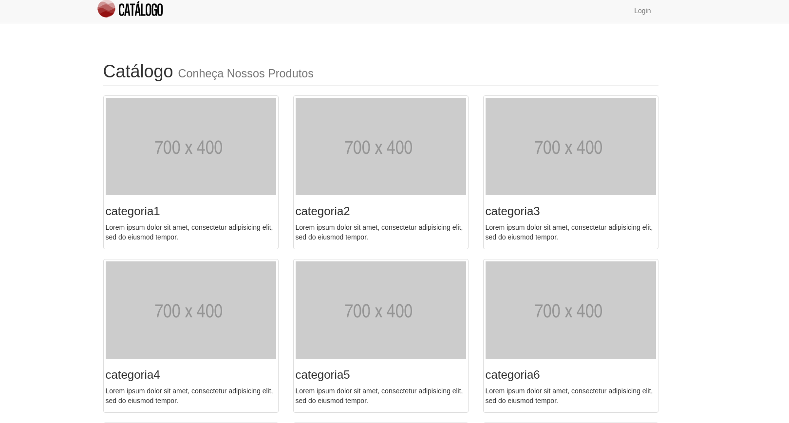
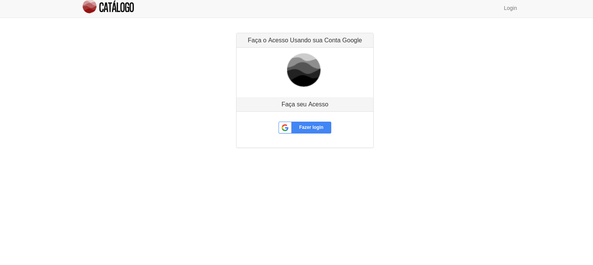
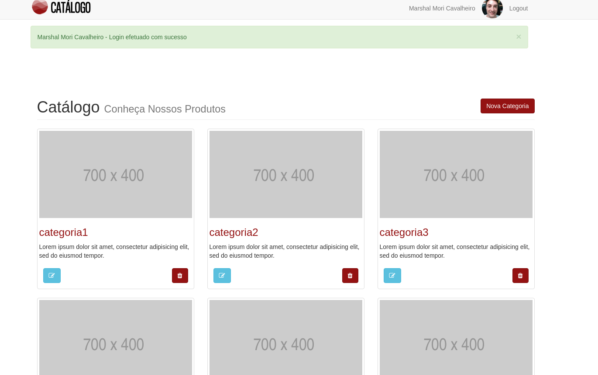
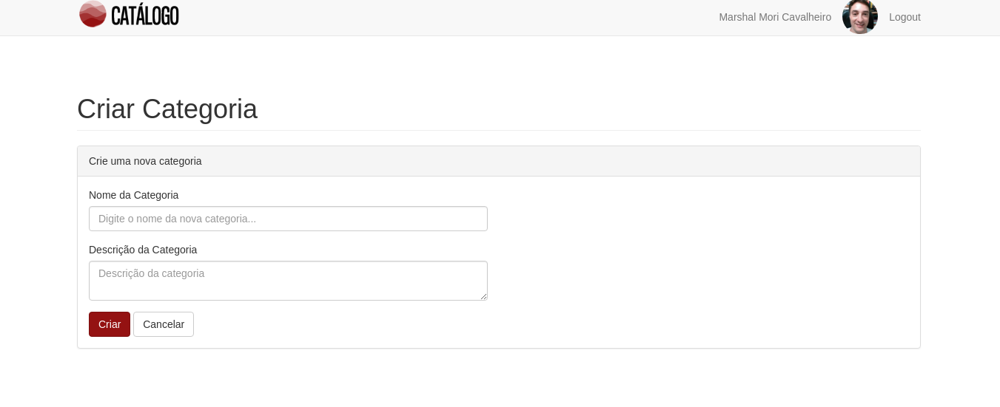
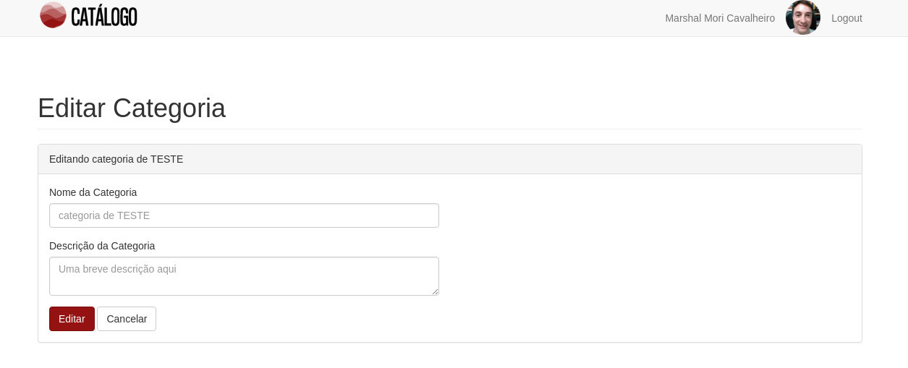
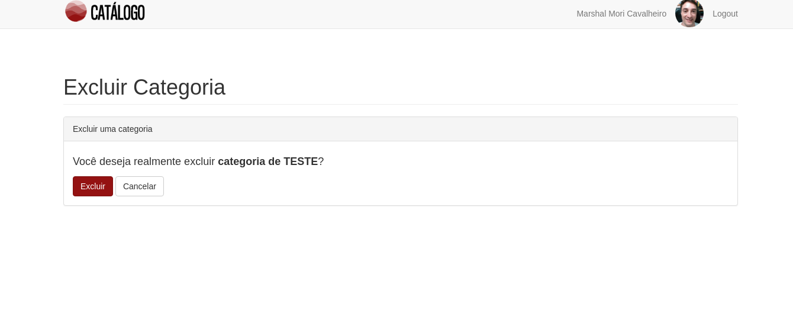
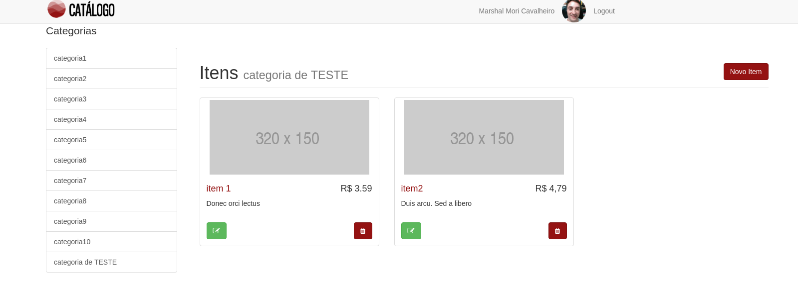
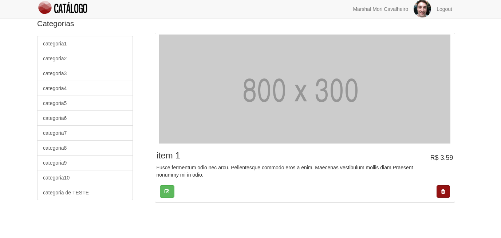

# Catálogo
Essa aplicação feita em Python utilizando o framework Flask é um catálogo de produtos. A página inicial apresenta as categorias dos produtos, ao acessar uma categoria você é apresentado aos itens presentes nesse grupo e em cada ítem é mostrado um imagem, preço e breve apresentação do protudo utilizando texto.

## Instalação
Abaixo temos os passos necessários para conseguir rodar esta aplicação:

1. **Instalar os pacotes utilizados no projeto** - utilizando o `pip` instale os seguintes pacotes mostrados abaixo:
    * `$ pip install Flask`
    * `$ pip install sqlalchemy`
    * `$ pip install passlib`
    * `$ pip install flask-httpauth`
    * `$ pip install httplib2`
    * `$ pip install psycopg2`
    * `$ pip install psycopg2-binary`
    * `$ pip install requests`
    * `$ pip install oauth2client`

2. **Download do projeto** - basta fazer um clone, fork ou download desse projeto, direto para sua máquina.
3. **Criar o banco de dados** - utilizando o comando `python database_setup.py` será criado o banco de dados chamado `catalogo.db`.
4. **Levantando a aplicação** - execute o comando `python app.py` para rodar a aplicação.
5. **Abrindo no navegador web** - escolha um navegador web e digite na `http://localhost:5000` na barra de navegação e aplicação será apresentada.

## Como utilizar a aplicação
Antes de utilizar a aplicação certifique-se de que executou os passos 4 e 5 do item anterior.

### Tela inicial
Abaixo é apresentado a tela inicial. Na imagem abaixo vemos algumas categorias, no entanto no seu caso não se preocupe caso não apareça os campos com as categorias isso está acontecendo porque no seu caso não foram cadastradas nenhuma categoria ainda.

### Fazer login
Para fazer login basta clicar no canto superior direito, sobre a palavra `Login` e a tela abaixo será apresentada. Para se logar basta clicar no botão azul escrito `Fazer login`. Ao clicar sobre o botão uma tela de autenticação do Google será aberta e apresentará pelo menos uma conta do Google (caso tenha cadastro no Google), escolha sua conta e você será redirecionado para a plataforma Catálogo.

### Dentro da plataforma - Logout, Nova Categoria, Editar Categoria, Deletar Categoria
Lembrando novamente, para você não aparecerá os cards com as categorias porque você não cadastrou nada ainda. Nessa tela você poderá fazer logout apenas clicando sobre a palavra `Logout` no canto superior direito e será levado a tela da primeira imagem. Para criar uma nova categoria basta clicar no botão `Nova Categoria` uma tela para preenchimento dos dados será apresentada (essa tela será mostrada abaixo). Fazer a edição de uma categoria já inserida é só clicar no botão azul claro que fica no canto esquerdo inferior, com isso você será levado para uma tela de edição dos dados da categoria (essa tela também será apresentada na sequência). Excluir uma categoria também é bem simples, é só clicar no botão com ícone de lixeira e uma página pedindo a confirmação será aberta.

### Nova categoria
A seguir temos a tela com os campos para criar uma nova categoria.

### Editar categoria
A seguir temos a tela com os campos para editar uma categoria.

### Deletar categoria
A seguir temos a tela com os campos para excluir uma categoria.

### Itens de uma categoria
Apresentar os itens criados de cada categoria é só clicar sobre o nome ou imagem de uma categoria e a tela abaixo será apresentada. Nessa tela podemos criar um novo item dessa categoria bastando para isso clicar no botão `Novo Item`. Se precisar editar um item basta clicar no botão verde no canto inferior esquerdo. Caso queira excluir o item clique no botão com ícone de lixeira. Assim com acontecia na categoria, ao clicar nos botões editar ou excluir você será levado para uma tela de edição ou exclusão. No canto esquerdo há uma lista com as categorias cadastradas, ao clicar em uma delas será mostrado os itens dessa categoria.

### Descrição de um item específico
Ao clicar sobre o nome ou imagem de um item específico será apresentado um tela semelhante à mostrada abaixo.

## Licença
O projeto Análise de Logs foi lançado com a licença [MIT
license](https://github.com/atom-community/markdown-preview-plus/blob/master/LICENSE.md).
